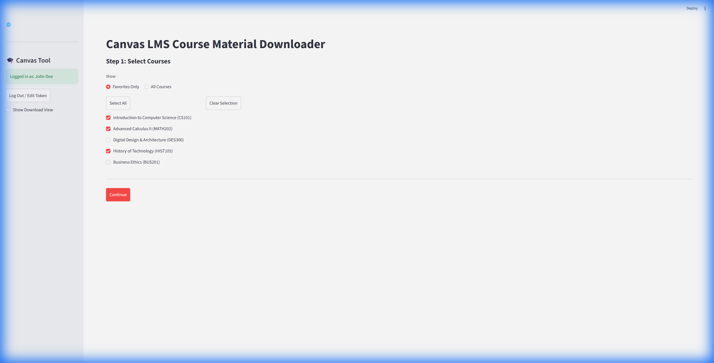
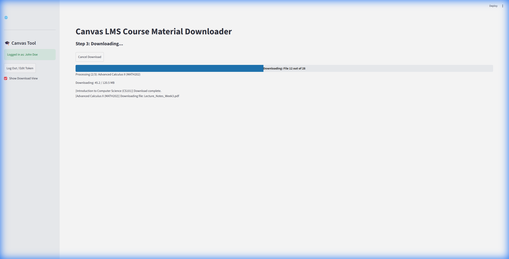

# Canvas Downloader

<p align="center">
  
</p>

This application allows students to batch download files and modules from Canvas LMS courses. It mirrors the exact module structure of your courses on your local drive, ensuring you have offline access to all your study materials.

<p align="center">
  
  
</p>

## Features
*   **One-Click Bulk Download**: Select multiple courses and download everything at once. This solves the pain of clicking "download" on hundreds of individual files.
*   **Module-Based Organization**: Creates folders that match your Canvas Modules perfectly (e.g., `Course Name/Week 1/Lecture.pdf`).
*   **Smart & Robust**:
    *   Async downloads for high speed.
    *   Automatic retries for network glitches.
    *   Handles restricted/unauthorized files gracefully (logs them instead of crashing).
*   **Study Mode**: Toggle to download only `.pdf` and `.pptx` files, skipping images and other clutter.

## Installation & Running

### For Users (Run from Code)
Since this is a Python application, you can run it directly from the source code on Windows, Mac, or Linux.

**Prerequisites:**
1.  **Install Python 3**: Download from [python.org](https://www.python.org/downloads/). *Ensure you check "Add Python to PATH" during installation.*

**Steps:**
1.  **Clone or Download**: Click the green "<> Code" button above and select "Download ZIP" (or `git clone` this repo).
2.  **Unzip**: Extract the folder.
3.  **Install Requirements**:
    Open your terminal/command prompt in the folder and run:
    ```bash
    pip install -r requirements.txt
    ```
4.  **Launch**:
    Run the start script:
    ```bash
    python start.py
    ```
    The application will automatically launch in your default web browser.

## Under the Hood: Technical Overview

This application is built as a hybrid local web app to combine the power of Python with a modern UI.

### Architecture
*   **Frontend**: Built with **Streamlit**, providing a responsive and clean web interface.
*   **Launcher**: A lightweight **Tkinter** wrapper (`start.py`) that manages the Streamlit server process in a background thread, giving users a simple "double-click" experience without needing to manage command-line servers manually.
*   **Canvas Integration**: Uses the **CanvasAPI** library to interact with the LMS. It handles pagination, rate limiting, and object retrieval (Files, Pages, Modules).

### Key Technical Features
*   **Asynchronous I/O**: The core downloader (`canvas_logic.py`) utilizes `asyncio` and `aiohttp`. This allows the app to download multiple files in parallel (concurrency limited to prevent API bans), significantly speeding up large course traversals compared to synchronous requests.
*   **Resiliency Patterns**:
    *   **Smart Retries**: Implements exponential backoff for HTTP 429 (Rate Limit) and 5xx errors.
    *   **Conflict Resolution**: Automatically renames files if duplicates exist (e.g., `Exam (1).pdf`) to prevent overwriting.
    *   **Sanitization**: Cleans filenames of illegal characters to ensure cross-platform compatibility (Windows/Mac/Linux).

## Security
*   **Local Execution**: The app runs entirely on your local machine (`localhost`).
*   **Token Safety**: Your API Token is stored locally in `canvas_downloader_settings.json` and is **never** sent to any external server other than the official Canvas API for authentication.

## License
MIT License. Feel free to modify and use this for your own studies!
